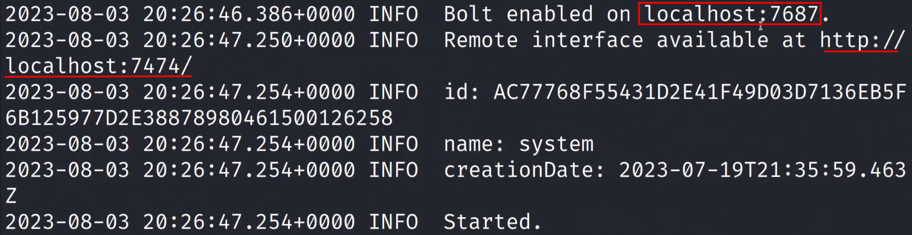
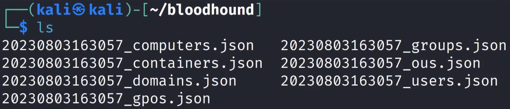
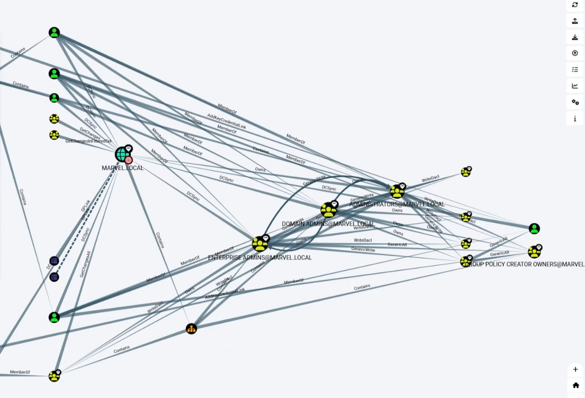

Bloodhound is constantly updating so...

```
sudo pip install bloodhound
```

We need neo4j to *visualize* data pulled by Bloodhound :  Run --> `sudo neo4j console`



In a new directory `bloodhound` (any other name is also fine)............

## Process

**Step 1:**
```
sudo bloodhound-python -d MARVEL.local -u fcastle -p Password1 -ns 192.168.138.136 -c all

-d is for domain
-u is for user
-p is for password
-ns is for nameserver, i.e., domain controller's ip
-c is for "what are we collecting?"..we are collecting everything

```

this collected the data..



**Step 2:**
Imported this in bloodhound and ...


