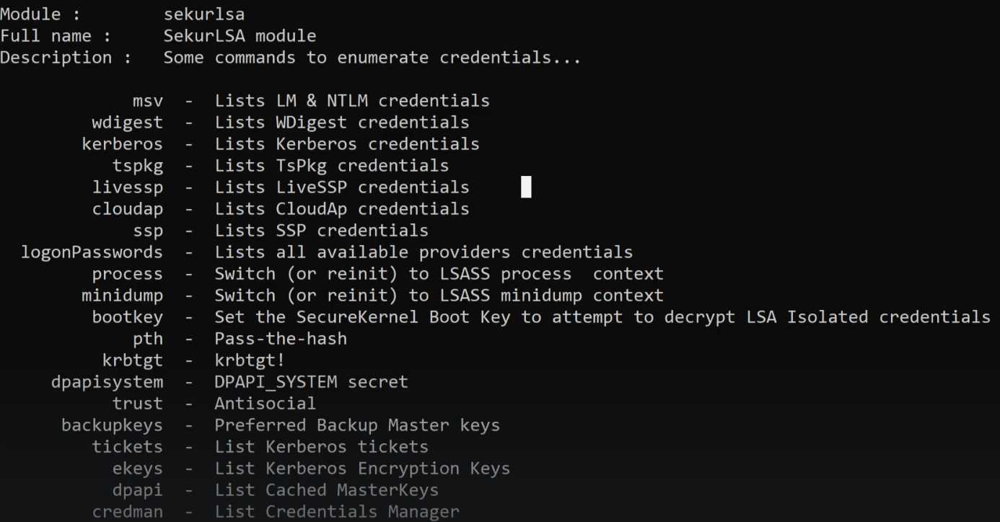

## Mimikatz
Link: https://github.com/gentilkiwi/mimikatz (download zip)  

Tool used to view and steal credentials, generate Kerberos tickets and leverage attacks  

Dump credentials stored in memeory  

Just a few attacks that this can do:   
- Credential Dumping
- Pass-the-Hash
- Over-Pass-the_Hash
- Pass-the-Ticket
- Silver Ticket
- Golden Ticket

#### Note:
Mimikatz gets picked up by any sort of AntiVirus  
So needs to be Obfuscated in ridiculous ways (outside the scope of PNPT)  

